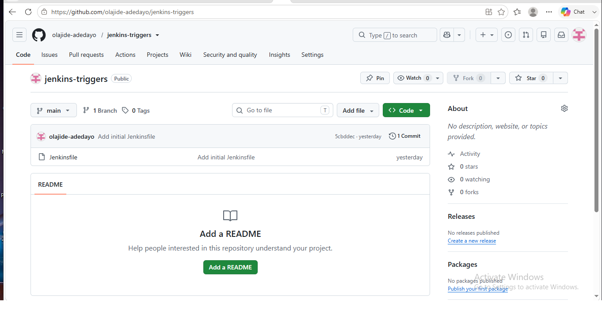
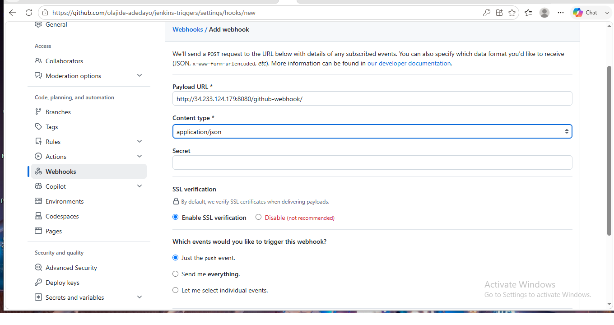
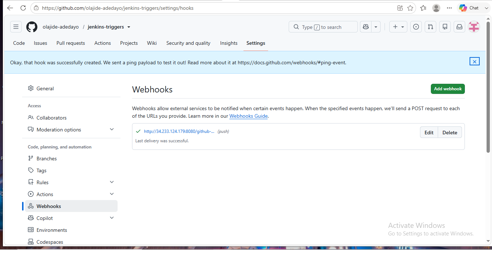
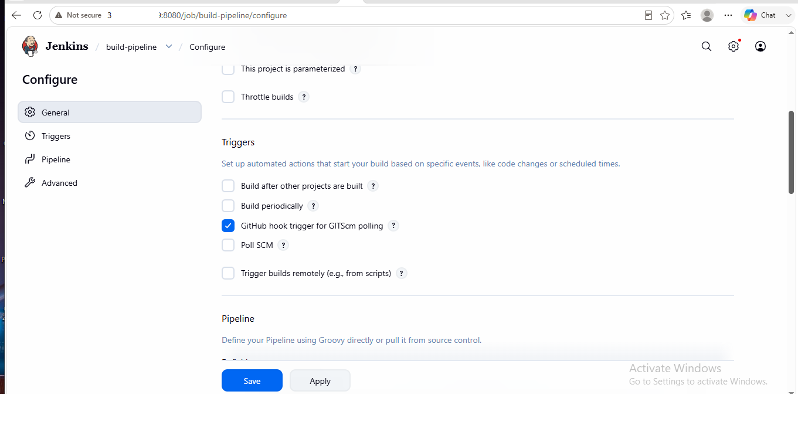
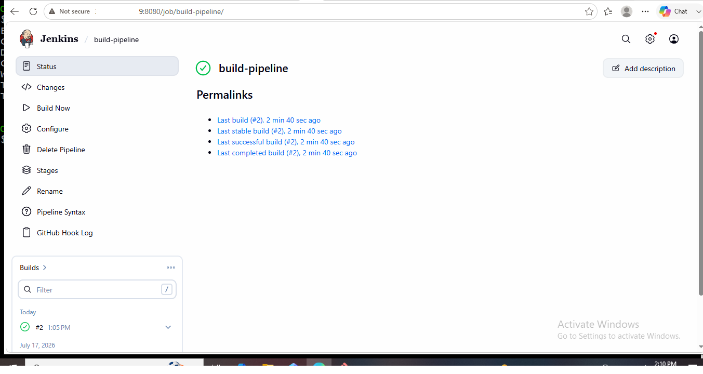
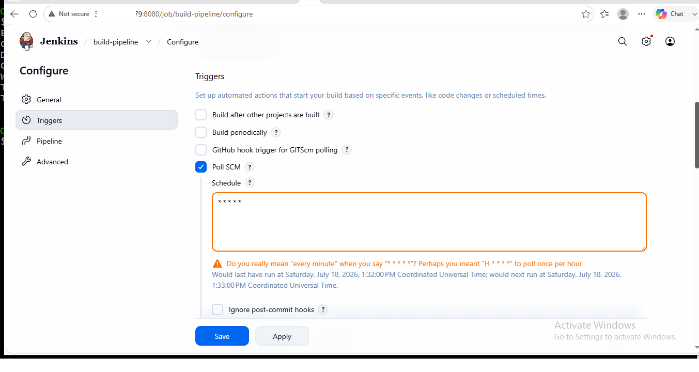
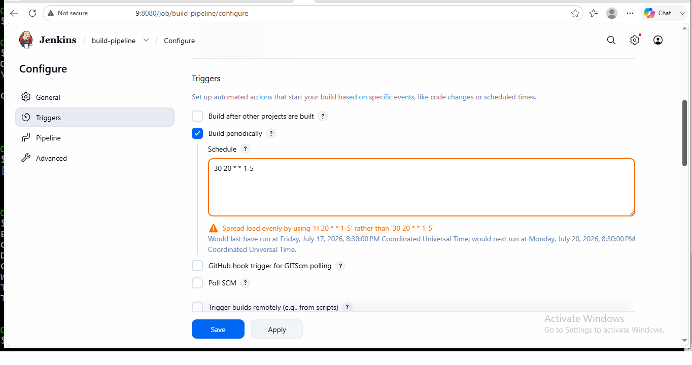
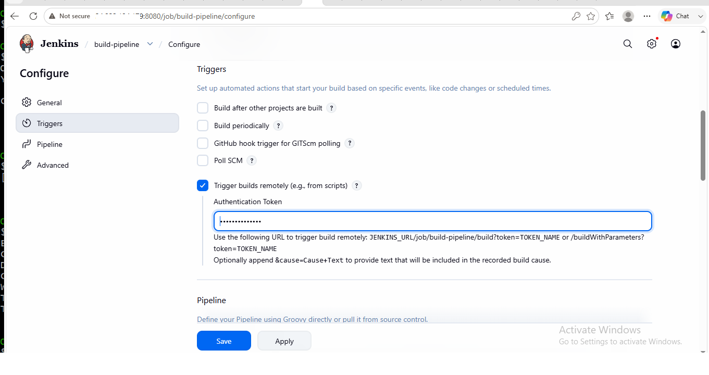
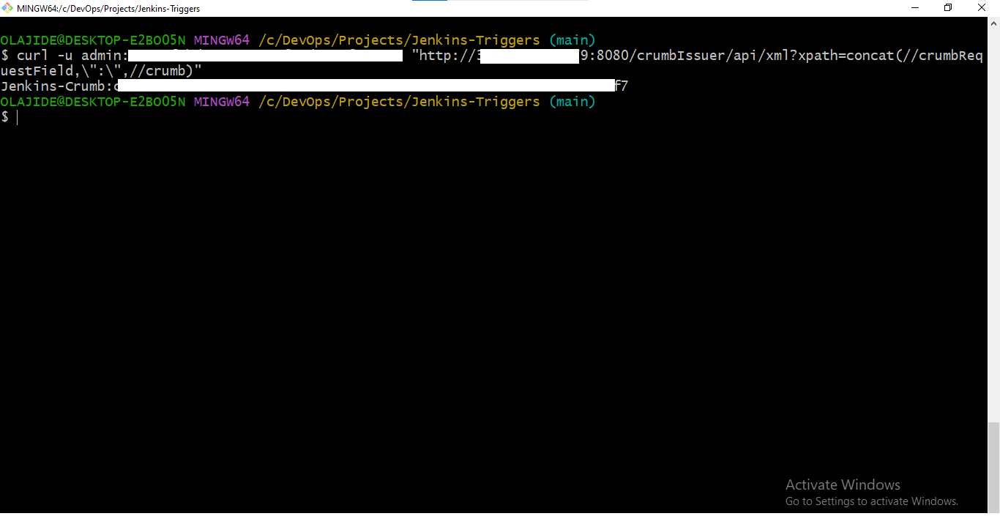
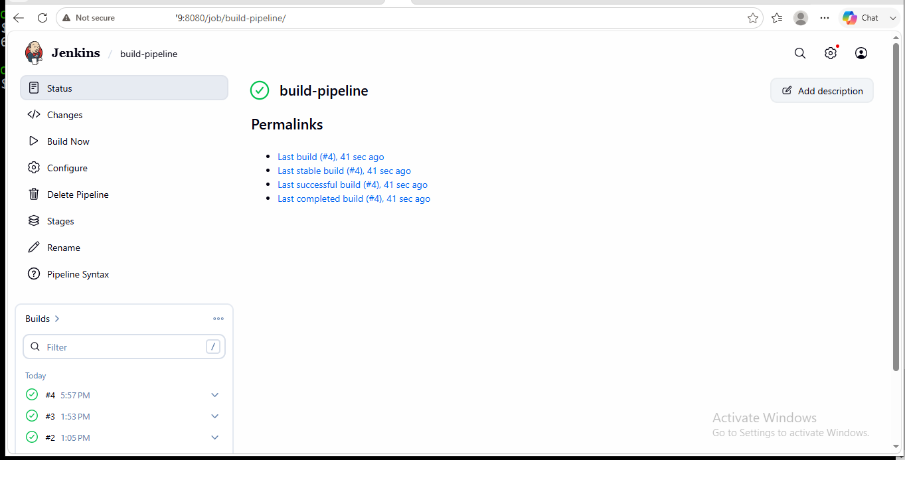

# Jenkins Build Triggers: Automating CI Pipelines with GitHub Webhooks, Poll SCM, Scheduled Builds, and Remote API

---

## 📖 Project Overview

This project demonstrates how to automate Jenkins Pipeline execution using multiple build trigger mechanisms. Rather than manually starting pipeline builds, Jenkins was configured to automatically execute a declarative Pipeline as Code based on different triggering strategies.

The implementation covers four widely used Jenkins build triggers:

- *GitHub Webhooks* – Automatically trigger pipeline execution whenever changes are pushed to the GitHub repository.
- *Poll SCM* – Periodically check the GitHub repository for source code changes using a cron schedule.
- *Build Periodically* – Schedule pipeline execution at predefined times using Jenkins cron expressions.
- *Remote Build Trigger* – Trigger pipeline execution remotely using the Jenkins Remote API, API Tokens, CSRF Crumbs, and curl.

The Jenkins Pipeline is integrated with a GitHub repository using SSH authentication. Each trigger mechanism was configured, tested, and validated through successful pipeline executions, demonstrating practical Continuous Integration (CI) automation techniques used in modern DevOps environments.

---

## 🎯 Business Objective

Modern software development teams require Continuous Integration (CI) pipelines that can automatically respond to code changes, scheduled tasks, and external automation events. Manually triggering pipeline builds is inefficient, error-prone, and does not scale for production environments.

The objective of this project was to implement and demonstrate multiple Jenkins build trigger mechanisms that automate pipeline execution based on different operational requirements. This improves development efficiency, reduces manual intervention, and enables faster feedback during the software delivery lifecycle.

By implementing multiple trigger methods, the project demonstrates how Jenkins can support event-driven, scheduled, repository polling, and remote API-based automation commonly used in enterprise DevOps environments.

---

## 🏗️ Solution Architecture

The solution integrates GitHub and Jenkins using a declarative Pipeline as Code stored in a GitHub repository and accessed through SSH authentication. Jenkins was configured to execute the pipeline using four different build trigger mechanisms, each serving a specific automation purpose.

### Architecture Workflow

1. Developers push code changes to the GitHub repository.
2. GitHub Webhooks immediately notify Jenkins to trigger pipeline execution.
3. Poll SCM periodically checks the repository for changes using a cron schedule when webhooks are not used.
4. Build Periodically executes the pipeline automatically at predefined times using Jenkins cron expressions.
5. Remote Build Trigger enables external applications or scripts to trigger Jenkins jobs securely using the Jenkins Remote API, API Tokens, CSRF Crumbs, and curl.
6. Jenkins executes the declarative pipeline and displays the build status and console output for each execution.

This implementation demonstrates multiple approaches to build automation, allowing Jenkins to support real-time event-driven builds, scheduled executions, repository polling, and secure remote job triggering.

---

## 🛠️ Technology Stack

The following technologies and tools were used to implement and validate this project:

| Category | Technology |
|----------|------------|
| Continuous Integration | Jenkins |
| Source Code Management | Git |
| Version Control Platform | GitHub |
| Pipeline | Declarative Jenkins Pipeline |
| Authentication | SSH Authentication |
| Build Triggers | GitHub Webhooks, Poll SCM, Build Periodically, Remote Trigger |
| Remote API | Jenkins Remote API |
| Security | API Token, Jenkins CSRF Crumb |
| Command Line | Git Bash |
| HTTP Client | cURL |
| Operating System | Amazon Linux 2023 (Jenkins Server) |
| Cloud Platform | Amazon Web Services (AWS EC2) |

---

## 📋 Prerequisites

Before implementing this project, ensure the following requirements are available:

- An active AWS account.
- A running Jenkins server hosted on an Amazon EC2 instance.
- Git installed and configured.
- GitHub repository containing the Jenkinsfile.
- SSH authentication configured between Jenkins and GitHub.
- GitHub Webhook access to the Jenkins server over port *8080*.
- Git Bash installed on the local workstation.
- cURL available for interacting with the Jenkins Remote API.
- Jenkins configured with the required plugins for Pipeline and Git integration.
- Internet connectivity for communication between GitHub and Jenkins.

---

## ☁️ AWS Infrastructure

The Jenkins automation environment was deployed on Amazon Web Services (AWS) using an Amazon EC2 instance. The server hosted the Jenkins application and integrated with GitHub over SSH authentication to execute Pipeline as Code workflows.

### Infrastructure Components

| AWS Service | Purpose |
|------------|---------|
| Amazon EC2 | Hosted the Jenkins server |
| Security Group | Allowed inbound access for SSH (22) and Jenkins (8080) |
| Amazon EBS | Persistent storage for the Jenkins server and build data |

The Jenkins server was configured to securely communicate with GitHub using SSH keys, enabling automated pipeline execution based on multiple build trigger mechanisms.

---

## 📂 Repository Structure

text
jenkins-triggers/
├── Jenkinsfile
├── poll-scm-test.txt
├── testfile.txt
└── README.md

### Repository Files

| File | Description |
|------|-------------|
| Jenkinsfile | Declarative Jenkins Pipeline used to execute the build process. |
| testfile.txt | Test file created to validate automatic pipeline execution using GitHub Webhooks. |
| poll-scm-test.txt | Test file created to verify Jenkins Poll SCM build trigger functionality. |
| README.md | Comprehensive project documentation, implementation guide, screenshots, troubleshooting, and lessons learned. |

---

## ⚙️ Jenkins Pipeline Workflow

The project uses a declarative Jenkins Pipeline stored in the GitHub repository. Jenkins retrieves the Jenkinsfile from the configured repository and executes the pipeline whenever a configured build trigger is activated.

The pipeline performs the following tasks:

1. Allocates an available Jenkins agent.
2. Executes the *Build* stage.
3. Runs a shell command to simulate the build process.
4. Displays a successful build message in the Jenkins console output.

### Jenkinsfile

groovy
pipeline {
    agent any

    stages {
        stage('Build') {
            steps {
                sh 'echo "Build completed."'
            }
        }
    }
}

---

## 🚀 Build Trigger Implementation

The project demonstrates four different methods of triggering Jenkins pipeline execution.

### 1. GitHub Webhook

GitHub Webhooks were configured to automatically notify Jenkins whenever code was pushed to the repository. This enabled event-driven pipeline execution without manual intervention.

### 2. Poll SCM

Jenkins was configured to periodically check the GitHub repository for source code changes using a cron schedule. When a new commit was detected, Jenkins automatically executed the pipeline.

### 3. Build Periodically

A scheduled build trigger was configured using Jenkins cron syntax to demonstrate time-based pipeline execution.

### 4. Remote Build Trigger

The Jenkins Remote API was configured to allow secure remote pipeline execution using:

- Authentication Token
- Jenkins API Token
- Jenkins CSRF Crumb
- curl

The remote build was successfully triggered from Git Bash, demonstrating secure external job execution through the Jenkins Remote API.

---

## 📸 Project Screenshots

The following screenshots capture the key implementation stages and successful validation of each Jenkins build trigger demonstrated in this project.

| Screenshot | Description |
|------------|-------------|
|  | *GitHub Repository Configuration* – Jenkins Pipeline repository containing the Jenkinsfile and project files. |
|  | *GitHub Webhook Configuration* – Configuring a webhook to notify Jenkins whenever code is pushed to the repository. |
|  | *Webhook Delivery Status* – Successful webhook delivery from GitHub to Jenkins. |
|  | *Jenkins Webhook Trigger* – Enabling the GitHub hook trigger for GITScm polling in Jenkins. |
|  | *Webhook Build Success* – Pipeline automatically triggered after a GitHub push event. |
|  | *Poll SCM Configuration* – Configuring Jenkins to periodically check the GitHub repository for changes. |
|  | *Build Periodically Configuration* – Scheduling automatic pipeline execution using Jenkins cron syntax. |
|  | *Remote Build Trigger Configuration* – Configuring Jenkins to accept authenticated remote build requests. |
|  | *Jenkins CSRF Crumb Generation* – Retrieving a CSRF crumb securely using the Jenkins API and curl. |
|  | *Remote Build Success* – Successful pipeline execution triggered through the Jenkins Remote API. |

---
